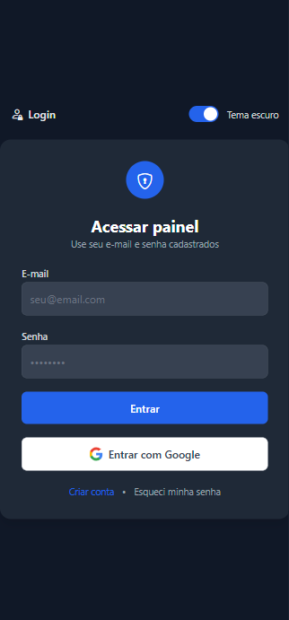

# 💰 Controle de Parcelas • Sistema Web

[](https://developer.mozilla.org/pt-BR/docs/Web/HTML)  
[](https://tailwindcss.com/)  
[](https://icons.getbootstrap.com/)  
[](https://firebase.google.com/)  
[](https://www.emailjs.com/)  
[](https://github.com/parallax/jsPDF)  
[]()  
[]()  
[](https://firebase.google.com/docs/auth/web/google-signin)  
[](https://web.dev/progressive-web-apps/)  
[]()

---

## 📖 História do Projeto  
Este sistema nasceu de uma **necessidade real**: minha esposa adquiriu um lote parcelado em **57 parcelas de R$ 2.000,00**.  
A ideia inicial era controlar os pagamentos em uma planilha de Excel, mas percebi que poderia criar uma solução muito mais eficiente, segura e moderna.  

Assim surgiu este projeto: um **sistema completo de controle de parcelas**, com:  
- Cadastro e autenticação de usuários (incluindo **Login com Google**)  
- Registro de pagamentos em banco de dados (Firebase)  
- Confirmação automática por e-mail (EmailJS)  
- Emissão de recibos em PDF (jsPDF)  
- Estatísticas em tempo real no Dashboard  
- Tema escuro persistente e interface responsiva  
- Instalação como **PWA**   

---

## 🚀 O que é PWA neste projeto?  
Este sistema é um **Progressive Web App (PWA)**, o que significa:  
- Pode ser **instalado no celular ou desktop** como se fosse um aplicativo nativo.  
- Abre em **tela cheia**, sem barra de endereço.  
- Possui **ícone próprio** (192px e 512px).  
- Funciona **offline** nas páginas principais, graças ao `service worker`.  
- É compatível com **Android e iOS**.  

👉 Ou seja, não é apenas um site: é um **aplicativo completo, profissional e multiplataforma**.  

---

## 🏗️ Arquitetura do Sistema  
Fluxo geral:  
**Front-end (Tailwind + JS) → Firebase (Auth + Firestore) → EmailJS → Usuário final**  

---

## 🛠️ Tecnologias Utilizadas  

- **HTML5**  
- **Tailwind CSS**  
- **Bootstrap Icons**  
- **Firebase (Auth + Firestore)**  
- **EmailJS**  
- **jsPDF**  
- **Exportação CSV**  
- **LocalStorage (tema persistente)**  
- **PWA (manifest + service worker)**  

---

## ⚙️ Funcionalidades  
- Cadastro e login de usuários  
- **Login com Google** integrado ao Firebase Auth  
- Proteção de rotas com Firebase Auth  
- Dashboard com estatísticas e gráfico  
- Controle de parcelas: pagar, marcar pago, recibo em PDF, exportação CSV  
- Envio de e-mail automático ao registrar pagamento  
- Tema claro/escuro com persistência  
- Instalação como **PWA** (Android, iOS e Desktop)  
- Responsividade total (desktop e mobile)  

---

## 🔐 Segurança  
- Autenticação via Firebase Auth  
- Proteção contra pagamentos duplicados (transações Firestore)  
- Controle de sessão (redirect se não logado)  
- Separação de credenciais sensíveis (`config.js`)  

---

## ☁️ Deploy  
- Firebase Hosting  

---

## 🖼️ Prints do Sistema  

### 📱 Versão Mobile  
<p align="center">
  
  
  
  
</p>
<p align="center">
  
  
  
  
</p>

---

### 💻 Versão Desktop  

#### 🔑 Login  
| Light | Dark |
|-------|------|
|  |  |

#### 📊 Dashboard  
| Light | Dark |
|-------|------|
|  |  |

#### 💵 Pagamento  
| Light | Dark |
|-------|------|
|  |  |

#### 📝 Cadastro  
| Light | Dark |
|-------|------|
|  |  |

---

## 🛣️ Possíveis Melhorias Futuras  
- Multiusuário (cada usuário com suas parcelas próprias)  
- Relatórios avançados no dashboard  
- Notificações via WhatsApp/Telegram  
- Melhorias visuais com animações  
- Push Notifications no PWA  

---

## 📦 Como Executar Localmente  

1. **Clonar o repositório**  
   ```bash
   git clone https://github.com/seuusuario/controle-parcelas.git
   cd controle-parcelas
