# 💰 Controle de Pagamentos

[](https://github.com/xaviermarcio/controle-pagamentos)
[](LICENSE)
[](https://tailwindcss.com)
[](https://icons.getbootstrap.com)
[](https://firebase.google.com)
[](https://firebase.google.com/products/hosting)

Aplicação web para controle de parcelas, com **login seguro (Firebase Auth)**, **dashboard interativo** e suporte a **modo claro/escuro** 🌗.  
Hospedada e funcionando **100% online**. 🚀  

---

## 💡 Motivação
Esse projeto nasceu da **necessidade de melhorar uma ideia real**.  
Uma pessoa havia comprado um lote e queria controlar as **parcelas restantes** em uma planilha de Excel.  

Eu propus criar uma **aplicação web completa** que tornasse o processo mais simples e confiável:  
- 📊 Controle visual de parcelas pagas e pendentes  
- 💵 Exibição clara do que já foi pago e do que ainda falta  
- 📧 Envio de comprovantes por e-mail  
- 📝 Geração de PDF de recibos para assinatura  
- 🌗 Tema claro e escuro  

O resultado foi o **Controle de Pagamentos**, muito mais moderno e prático do que o Excel original.

---

## 🚀 Funcionalidades

- 🔐 **Autenticação completa** (login, cadastro e recuperação de senha)  
- ✅ **Checklist dinâmico de senha forte** no cadastro  
- 📊 Dashboard interativo com estatísticas  
- 💵 Controle de parcelas (pagas/pendentes)  
- 📤 Exportação de pagamentos para CSV  
- 📧 Envio automático de comprovante via EmailJS  
- 📝 Geração de recibo em PDF com espaço para assinatura  
- 🌗 Tema claro e escuro  
- 📱 Totalmente responsivo (desktop e mobile)  

---

## 🖼️ Screenshots

### 🖥️ Desktop (Light)

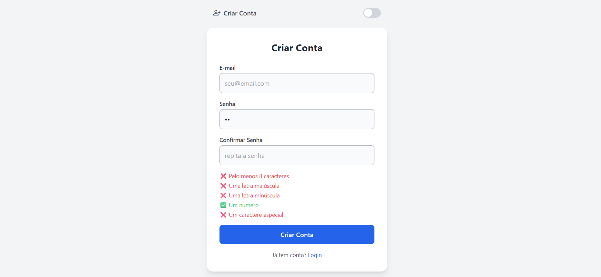
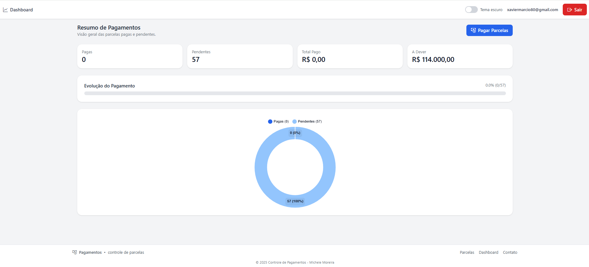
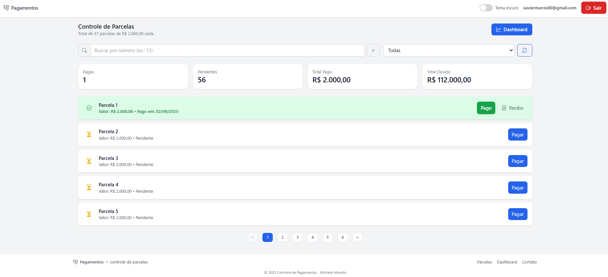

### 🖥️ Desktop (Dark)
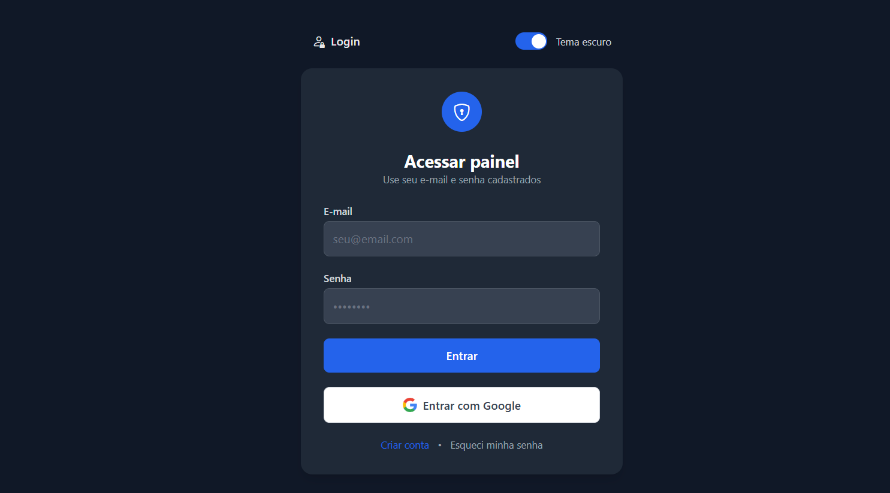
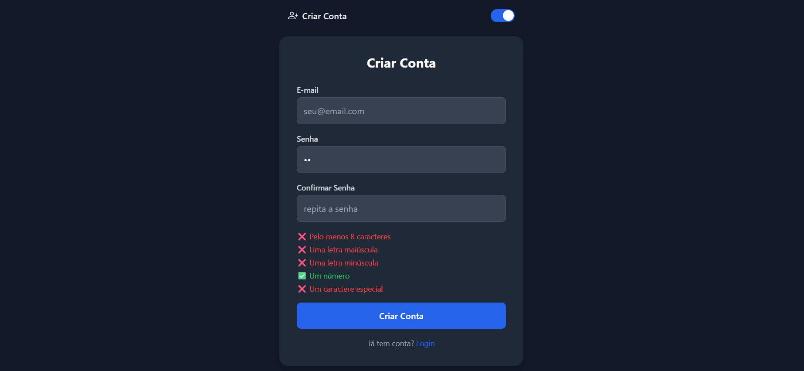
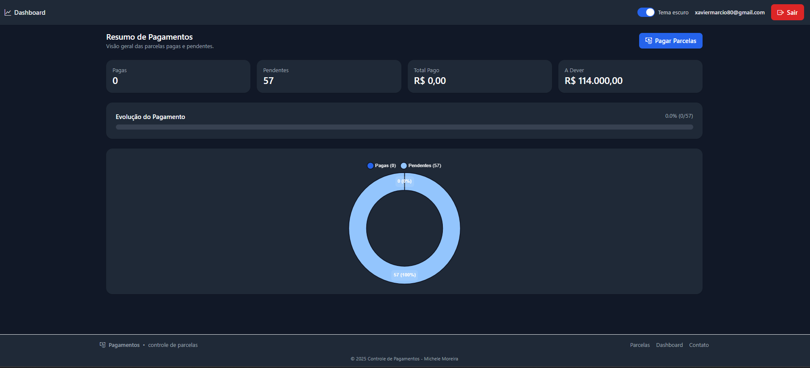
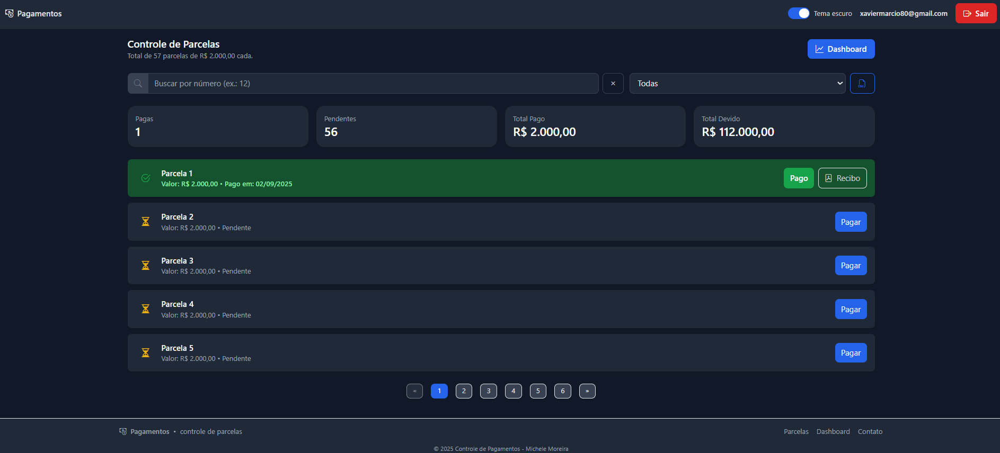

### 📱 Mobile (Light)
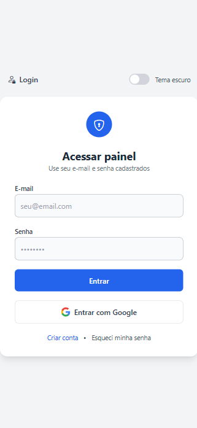
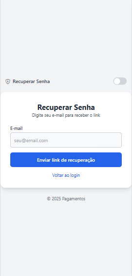
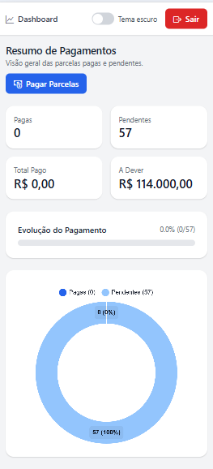
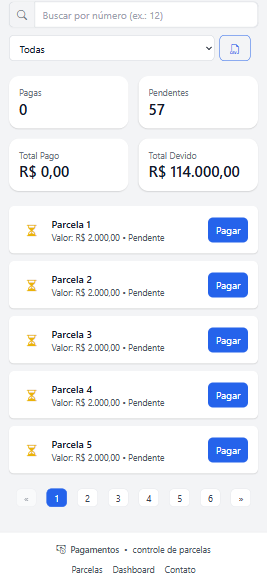

### 📱 Mobile (Dark)

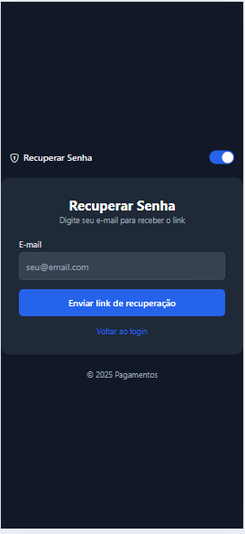
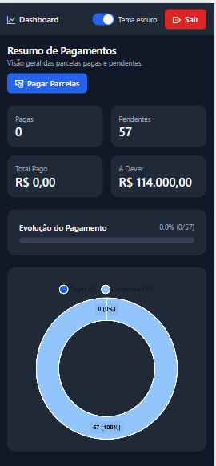


---

## ⚙️ Tecnologias Utilizadas
- [TailwindCSS](https://tailwindcss.com)  
- [Bootstrap Icons](https://icons.getbootstrap.com)  
- [Firebase (Auth + Firestore)](https://firebase.google.com)  
- [Chart.js](https://www.chartjs.org/)  
- [EmailJS](https://www.emailjs.com)  
- [jsPDF](https://github.com/parallax/jsPDF)  

---

## 📂 Estrutura de Arquivos

```bash
/
├── index.html        # Tela de Login
├── register.html     # Tela de Registro
├── reset.html        # Recuperação de senha
├── parcelas.html     # Lista de parcelas
├── dashboard.html    # Painel de estatísticas
├── js/               # Scripts JS (auth, dashboard, parcelas etc.)
├── images/           # Screenshots (light/dark, mobile/desktop)
├── config.example.js # Modelo de configuração
├── .gitignore        # Exclusões de segurança
└── README.md         # Documentação
```

---

## 🛠️ Configuração do Projeto

1. Clone este repositório:
   ```bash
   git clone git@github.com:xaviermarcio/controle-pagamentos.git
   ```

2. Crie um arquivo `config.js` na raiz baseado no `config.example.js`:
   ```javascript
   export default {
     apiKey: "SUA_CHAVE_AQUI",
     authDomain: "SEU_PROJETO.firebaseapp.com",
     projectId: "SEU_PROJETO",
     storageBucket: "SEU_PROJETO.appspot.com",
     messagingSenderId: "SEU_ID_AQUI",
     appId: "SEU_APP_ID_AQUI"
   };

   export const EMAILJS = {
     PUBLIC_KEY: "SUA_PUBLIC_KEY_AQUI",
     SERVICE_ID: "SEU_SERVICE_ID_AQUI",
     TEMPLATE_ID: "SEU_TEMPLATE_ID_AQUI"
   };
   ```

3. Certifique-se de que o `config.js` **não seja versionado** (já está no `.gitignore`).  

4. Abra o projeto em um servidor local ou faça o deploy no Firebase Hosting.

---

## 🌐 Demonstração Online
👉 [Acesse aqui a aplicação](https://SEU-LINK-DO-PROJETO)  
*(adicione seu link real aqui depois)*  

---

## 📜 Licença
Este projeto está sob a licença MIT.  
Sinta-se à vontade para usar e modificar.
